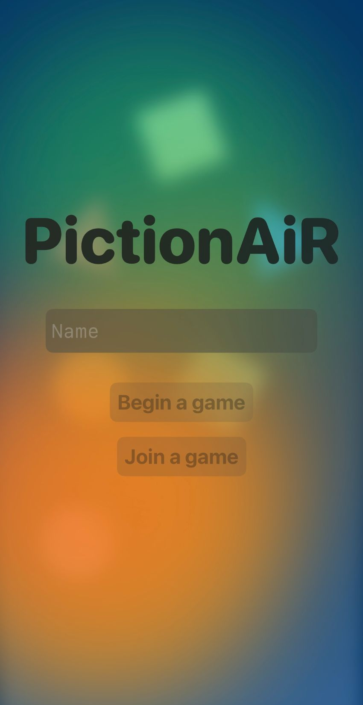
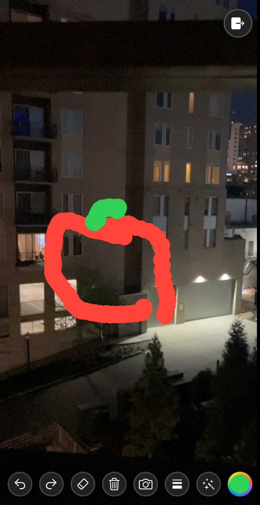

# PictionAiR

## About the Project

An interactive iOS mobile app to play Pictionary in AR world with multi-peer connectivity feature. Convert your drawings into 3D AR objects.

## Views

<table>
  <tr>
    <th>Main Screen</th>
    <th>Hello ARWorld</th>
  </tr>
  <tr>
    <td></td>
    <td></td>
  </tr>
</table>
<table>
  <tr>
    <th>Multipeer Connectivity</th>
    <th>Game View</th>
  </tr>
  <tr>
    <td></td>
    <td></td>
  </tr>
</table>
<table>
  <tr>
    <th>2D Drawing</th>
    <th>3D Drawing Generation</th>
  </tr>
  <tr>
    <td></td>
    <td></td>
  </tr>
</table>

